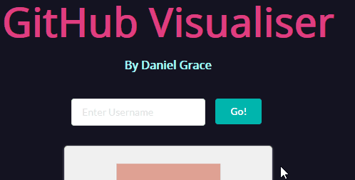
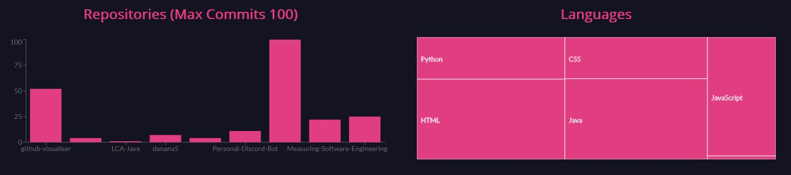
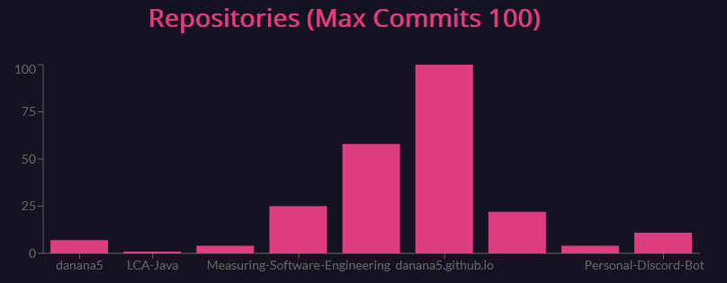
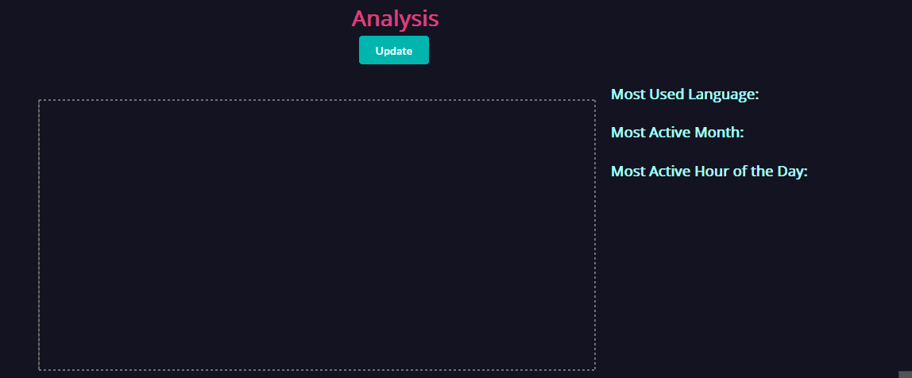
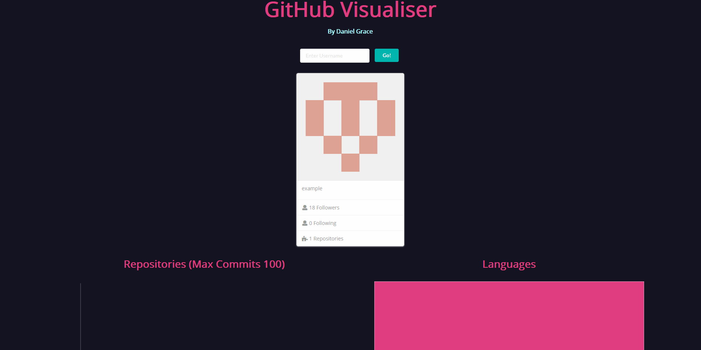

# Github-Visualiser
An app created as part of my third year Software Engineering module which visualises data using the Github API.
### Prerequisites
To run this project, you will need the following installed:

- Docker

## Running the Project
Navigate to the `github-visualiser` folder and run the following terminal commands:

```
docker build -t <your_image_name_here> .
docker run -it -p 8080:3000 --rm <your_image_name>
```
The docker container is now running and the project should be accessible on `localhost:8080`.

## Project Description
This project was created as part of an assignment in the CSU33012 Software Engineering module in Trinity College Dublin. The project accepts a user input of a github username and the project will interogate the GitHub REST API with this username and present to the user the data retrieved from the API. The data is visualised in three sections.

1. Basic User Data i.e Name, Followers, Following etc.
2. Intermediate User Data i.e graphing their most contributed to repositories.
3. Analytics based on the User Data i.e determining their most active month and hour on github.

The project was written in React.js and is fully dockerized. To run the project follow the instructions above.

## Breakdown

### Search Bar


The search bar appears at the top of the screen and allows the user to input a GitHub username into the search bar and submit their query.

If the user enters a username that can not be linked to a GitHub account the program alerts the user.



### User Card and Basic Stats


A card like this is displayed once the search for a user has finished and it displays the users; avatar, name, username, bio, amount of repositories and the amount of followers/following.


A small card showing the users basic stats and rating from A+ to S+.

### Graphs



This is the visualisation of the users commits to repositories on the bar graph on the left and then the languages these commits are made of on the tree map on the right.



The bar chart with the repos is interactive and upon mouse hover shows the data being visualised.

### Analytics



The analytics calculated for Linus Torvalds GitHub account highlighting his most active hour on GitHub and his most active month.

## Example


